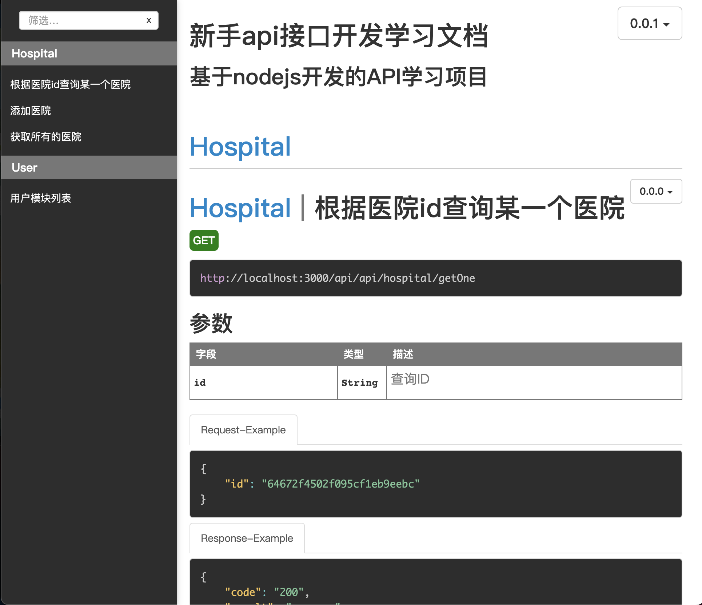

# apiDoc（https://apidocjs.com/）

## 1.项目内新建apidoc.json,添加apiDoc说明及配置信息

## 2.使用方法：（生成接口文档）
在项目目录下执行：（eg:apidoc -i ./controllers -o ./apidoc）
```bash
apidoc -i ./接口注释目录 -o ./接口文档存放目录
```
（项目内自动生成apidoc文件夹，打开index.html）


## 3.在controllers内的controller内添加apiDoc注释信息来创建API文档
eg:

## 4.本项目修改（升级）需要修改apidoc.json内参数 version(版本号)；再次重新运行（apidoc -i ./controllers -o ./apidoc）